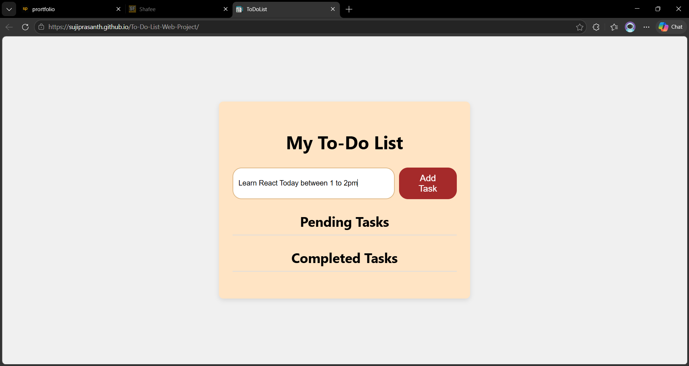
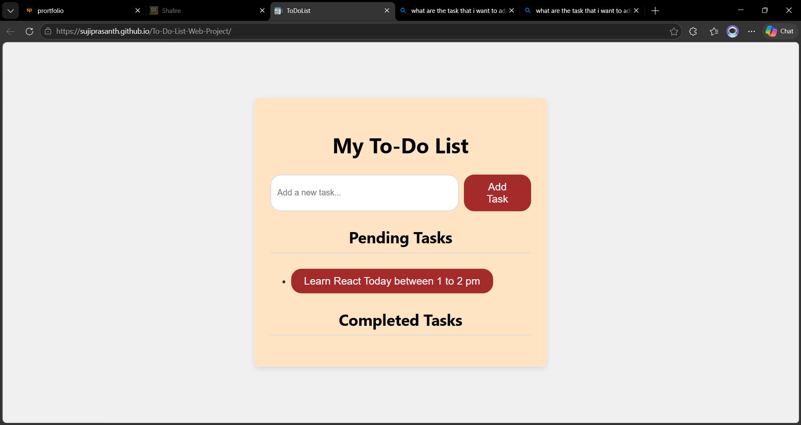
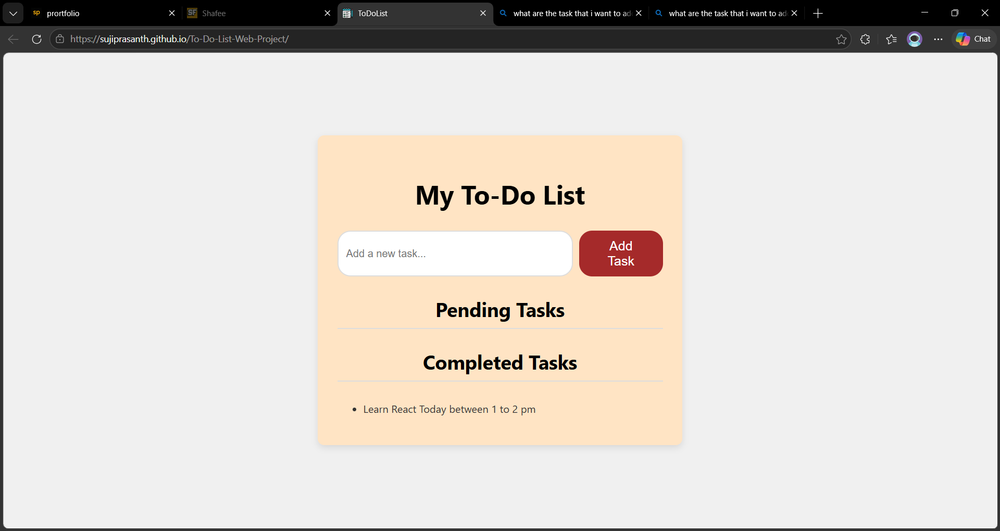

# 📝 To-Do List Web App

A responsive and user-friendly To-Do List application built using HTML, CSS, and JavaScript. This project allows users to efficiently manage their daily tasks by organizing them into pending and completed sections with simple interactions.

## 🚀 Features
- ➕ Add new tasks instantly
- 📌 Tasks are added to the **Pending** list
- ✅ Click on a task to move it to **Completed**
- ❌ Remove tasks from the completed list
- 🎯 Clean and minimal user interface
- ⚡ Fast and lightweight (no libraries required)

## 🛠️ Technologies Used
- HTML5
- CSS3
- JavaScript (Vanilla JS)

## 📂 Project Structure
│── index.html
│── style.css
│── script.js

# My To-Do List Project

Here are the screenshots of my project:

## ▶️ How to Run
1. Download or clone the repository
2. Open `index.html` in your browser

## 🌐 Live Demo
https://sujiprasanth.github.io/To-Do-List-Web-Project/

## 📌 Use Case
Great for managing daily tasks and practicing basic JavaScript DOM manipulation.

## 🙌 Author
Suji Prasanth
